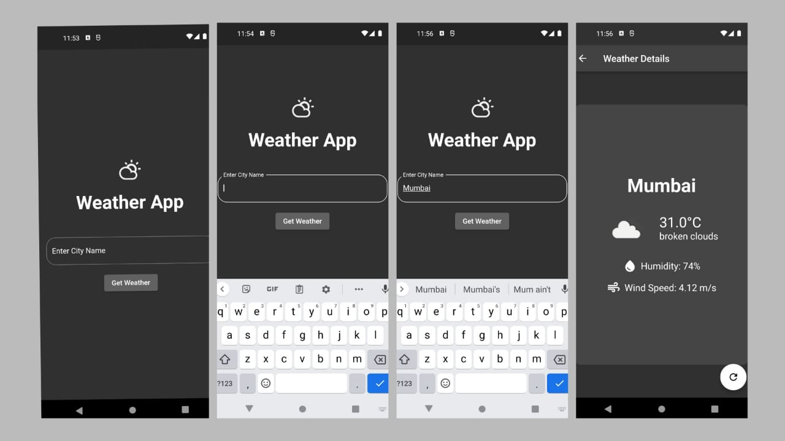

# Weather App

A simple and intuitive weather application built with Flutter. This app allows users to check the current weather conditions of any city by entering the city name. The app fetches real-time weather data and displays it in a user-friendly interface.

## Features

- Real-time weather updates
- Location-based weather information
- Detailed weather data including temperature, humidity, wind speed, and weather conditions
- Glass-like UI with animations for a modern look and feel
- Error handling for network and data fetching issues

## Screenshots



## Getting Started

### Prerequisites

To run this project, you will need:

- [Flutter](https://flutter.dev/docs/get-started/install) (latest version recommended)
- [Dart](https://dart.dev/get-dart)
- An IDE such as [Visual Studio Code](https://code.visualstudio.com/) or [Android Studio](https://developer.android.com/studio)

### Installation

1. Clone the repository:

    ```bash
    git clone https://github.com/archanarackenchath/weather_app.git
    cd weather_app
    ```

2. Install the dependencies:

    ```bash
    flutter pub get
    ```

3. Run the app:

    ```bash
    flutter run
    ```

## Usage

1. Open the app on your device or emulator.
2. Enter the name of a city in the text field.
3. Tap the "Get Weather" button to fetch and display the weather details.

## Project Structure

```bash
weather_app/
├── lib/
│   ├── main.dart
│   ├── screens/
│   │   ├── home_screen.dart
│   │   ├── weather_screen.dart
│   ├── providers/
│   │   ├── weather_provider.dart
│   ├── models/
│   │   ├── weather.dart
│   ├── services/
│   │   ├── weather_api.dart
├── assets/
│   ├── images/
│   │   ├── weather_icon.png
├── pubspec.yaml
└── README.md


